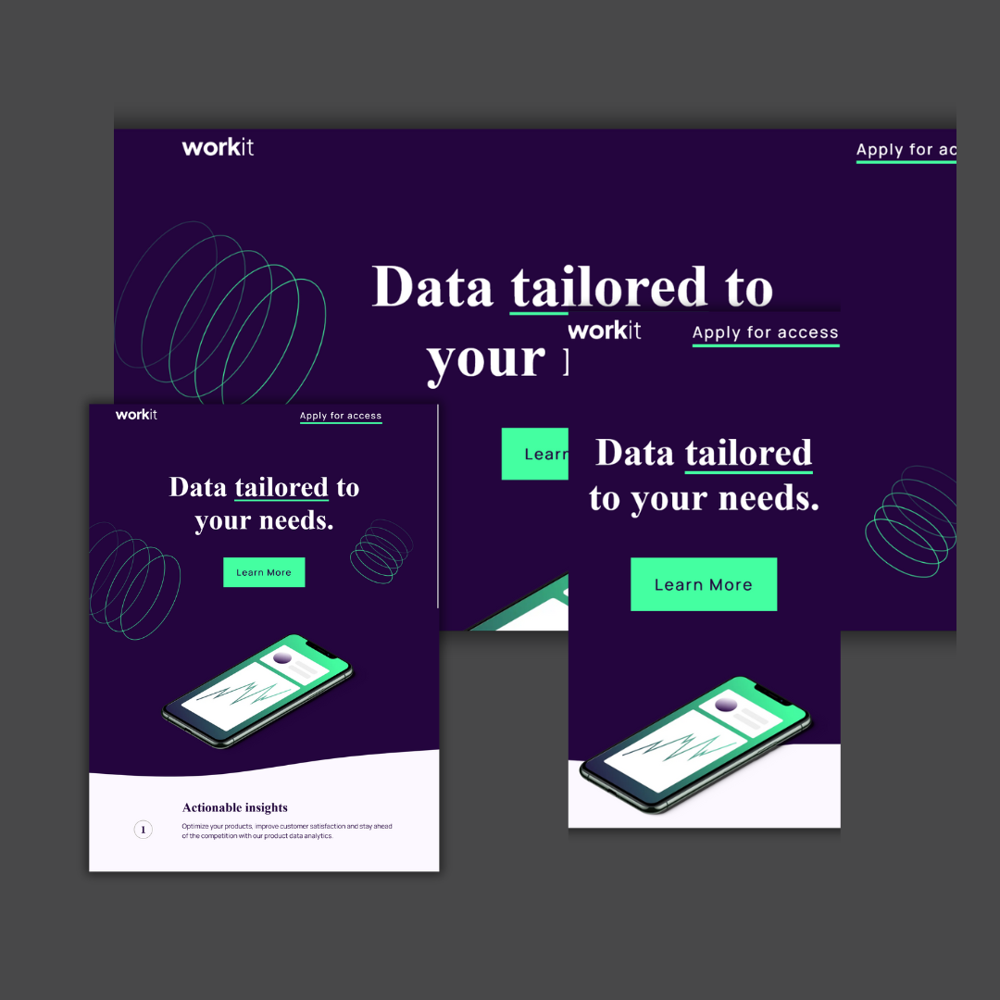

## Welcome to Worfit Landing Page! 👋

This was my first ever project of web development made from scratch. It was made using HTML and CSS.

This is a solution to the [Worfit Landing Page!](https://www.frontendmentor.io/challenges/workit-landing-page-2fYnyle5lu). 

Frontend Mentor challenges help to improve coding skills by building realistic projects. 

## Table of contents

- [Overview](#overview)
  - [The challenge](#the-challenge)
  - [Screenshot](#screenshot)
  - [Links](#links)
- [My process](#my-process)
  - [Built with](#built-with)
  - [What I learned](#what-i-learned)
  - [What can be improved](#What-can-be-improve)
- [Author](#author)

## Overview

### The challenge

The challenge is to build out this landing page and get it looking as close to the design as possible.

The users should be able to:

- View the optimal layout for the interface depending on their device's screen size
- See hover and focus states for all interactive elements on the page

### Screenshot

### Links

- Solution URL: [Github](https://github.com/jaedevgithub/workitLandingPage)

- Live Site URL: [Github Pages](https://jaedevgithub.github.io/workitLandingPage/)

## My process

### Built with

- Semantic HTML5 markup.
- Flexbox.
- CSS Grid.

### What I learned

- This is my first ever project of Front End. This is a new version of the original repository that I upload to GitHub. In this version, I remade the website entirely and fix some issues with media queries and responsiveness.

### What can be improve

- For some reason, underlines are not working on mobile.

## Author

- Frontend Mentor - [@jaegit123](https://www.frontendmentor.io/profile/jaegit123)
